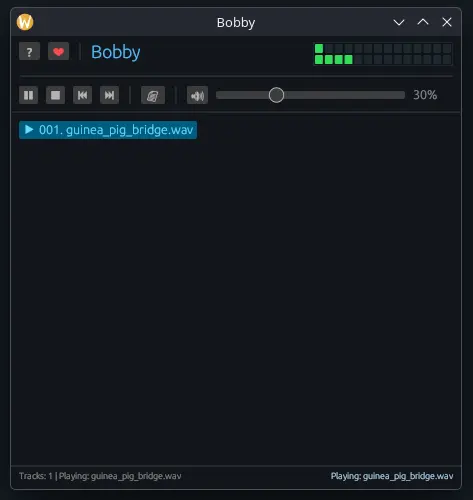

# Bobby — Tiny Linux Audio Player
Bobby is a lightweight, fast, directory-based audio player written in Rust for Linux inspired by [Billy](https://github.com/zQueal/Billy).


---

## Features

- ⚡ **Instant Directory Loading**: Loads thousands of songs in seconds without tag pre-scanning delays.
- 🎵 **Format Support**: Plays MP3, FLAC, OGG Vorbis, WAV, M4A, AAC, and Opus natively.
- ⏱️ **Interactive Seek Bar**: Real-time position tracking with smooth mouse-release scrubbing (`0:00` / `3:45`).
- 📊 **Audio Track Stats**: Live container format, bitrate in Kbps, and channel configuration (`MP3 128 Kbps Stereo`, `WAV 1411 Kbps Mono`).
- 🎛️ **Retro 14-LED Peak Level Meter**: Real-time dual-channel peak VU meters.
- 📜 **Monospace Playlist & Zebra Striping**: Full-width extension-preserving middle filename truncation (`really_long_f...mp3`) with alternating row highlights.
- 🖱️ **Mouse Wheel Volume Control**: Hover over volume controls and scroll mouse wheel up/down to adjust volume in 1% steps.
- 💾 **Persistent Settings & Window Geometry**: Automatically remembers volume, playmode, last folder, and window size/position in `~/.config/bobby/bobby_config.json`.
- ⌨️ **100% Keyboard Driven**: Full keyboard shortcuts for playback, search, file operations, and navigation.
- 🔍 **Easy Finder (`/` or `F3`)**: Instant search and filter overlay across loaded directories.
- ✏️ **Batch File Replacer (`F2`)**: Multiple file filename replacer directly inside your playlist.
- 📁 **Parent Folder View Toggle (`F8`)**: Easily display parent subfolder names alongside track filenames.

---

## Installation & Setup

### Option 1: Download Release Binary (Recommended)

1. Download `bobby-linux-x86_64.tar.gz` from the [Releases](https://github.com/Erumite/Bobby/releases) page.
2. Extract the archive:
   ```bash
   tar -xvf bobby-linux-x86_64.tar.gz
   ```
3. Copy the binary to your local bin path:
   ```bash
   mkdir -p ~/.local/bin ~/.local/share/applications
   cp bobby ~/.local/bin/
   chmod +x ~/.local/bin/bobby
   ```
4. Register file associations for Dolphin / KDE / GNOME:
   ```bash
   cp bobby.desktop ~/.local/share/applications/
   update-desktop-database ~/.local/share/applications
   ```
5. Right-click any `.mp3` or audio file in Dolphin / file manager -> **Open With** -> Select **Bobby** (or set as Default Application).

---

### Option 2: Build From Source

#### Requirements
- Rust toolchain (`cargo`, `rustc`)
- `alsa-lib` development headers (e.g. `brew install alsa-lib` or `sudo apt install libasound2-dev pkg-config`)

#### Build & Install
Run the automated installer script (can be run from any directory):
```bash
chmod +x install.sh
./install.sh
```

Or build manually:
```bash
cargo build --release
./target/release/bobby
```

---

## Keyboard Shortcuts

| Shortcut | Action |
| :--- | :--- |
| `F1` | Toggle keyboard shortcuts guide |
| `F4` | Open directory selection dialog |
| `F5` | Refresh current directory for new/removed files |
| `F8` | Toggle parent subfolder view mode |
| `F2` | Rename single track or launch batch file replacer |
| `Del` | Remove selected track(s) from playlist |
| `Ctrl + Del` | Crop playlist to selected items |
| `Space` | Play / Pause playback |
| `Ctrl + 1..0` | Set volume in 10% increments (`Ctrl+1` = 10%, `Ctrl+0` = 100%) |
| `Ctrl + M` | Cycle playmodes (Normal, Single, Repeat All, Repeat 1, Shuffle) |
| `Home` | Jump to top of playlist |
| `/` or `F3` | Open Easy Finder instant search modal |

---

## Simple UI Preview:


